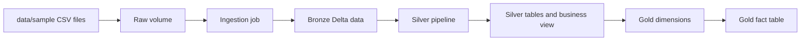

# AirLake

Databricks Asset Bundle for a medallion architecture data pipeline

## Requirements

- Databricks workspace with Unity Catalog enabled.
- Databricks CLI installed and authenticated.
- Permission to create and write to the configured catalog, schemas, and volumes.
- Sample files in `data/sample`.

## Configure

Set workspace/catalog-specific values in `databricks.yml`. The bundle passes them to the
setup, ingestion, silver, and gold resources.

## Deploy

From the project root:

```powershell
databricks bundle validate -t dev
databricks bundle deploy -t dev
```

Run the deployed resources in this order:

1. `AirLake-dev-setup` creates schemas, volumes, and raw-data folders.
2. Upload the CSV files from `data/sample` to the raw volume `data` subfolders. (A script will be made for this shortly)
3. `AirLake-dev-ingestion-job` loads CSV files into bronze Delta data.
4. `AirLake-dev-silver-pipeline` creates silver tables and the business view.
5. `AirLake-dev-gold-dimensions` updates gold dimensions, then the fact table.

The jobs use serverless compute. Databricks Free Edition may limit concurrent or
active serverless runs; stop unused jobs and pipeline updates before retrying.

## Data Flow



## Layout

```text
databricks.yml       Bundle variables and targets
resources/           Jobs and pipeline definitions
src/notebooks/       Setup, ingestion, and gold notebooks
src/Pipelines/       Silver tables and views
data/sample/         Sample input data
```
